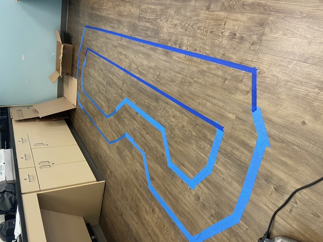
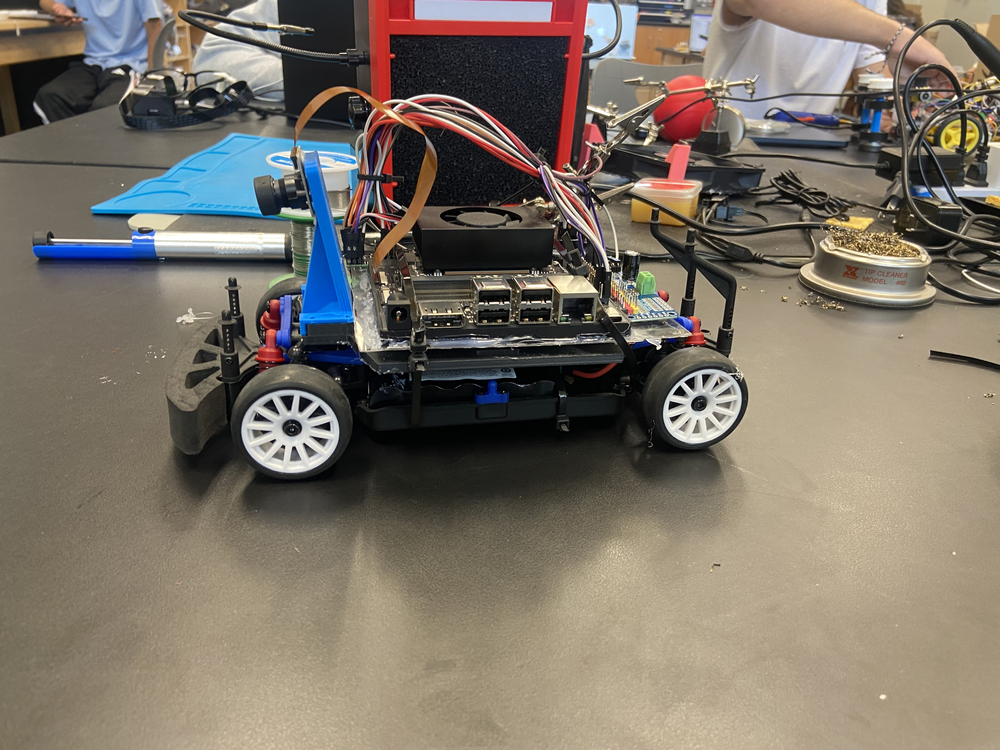
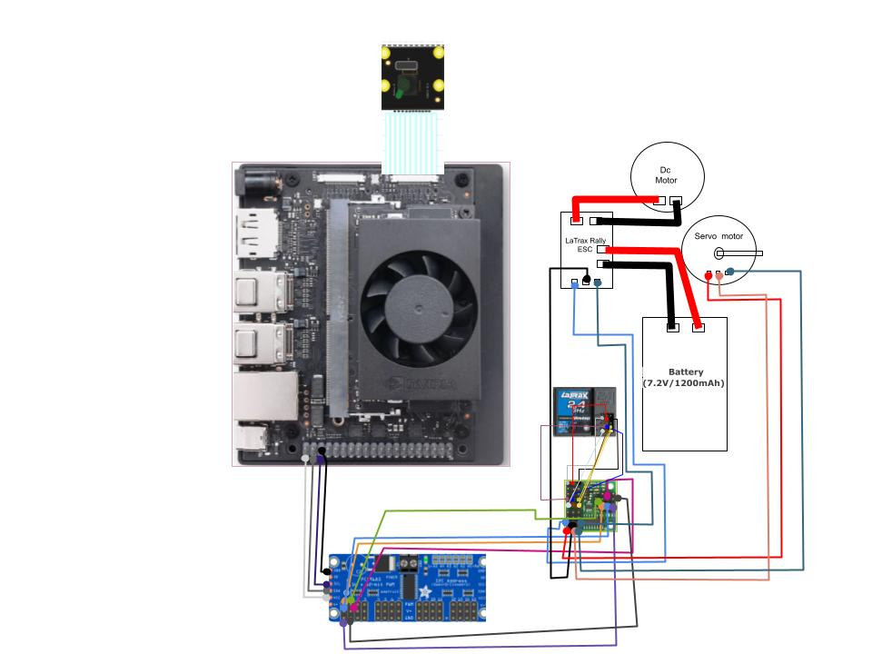
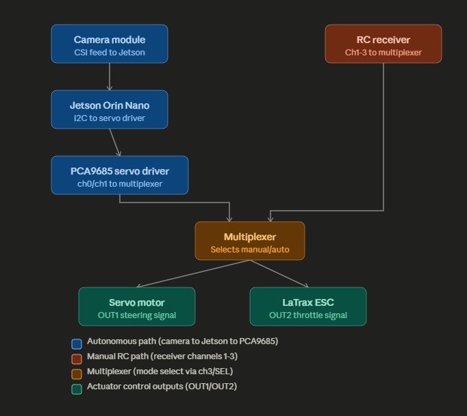
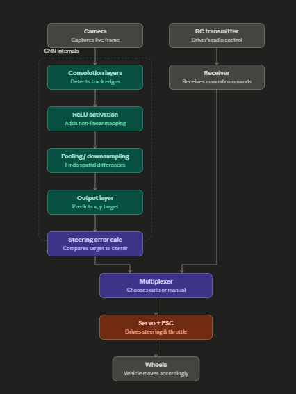
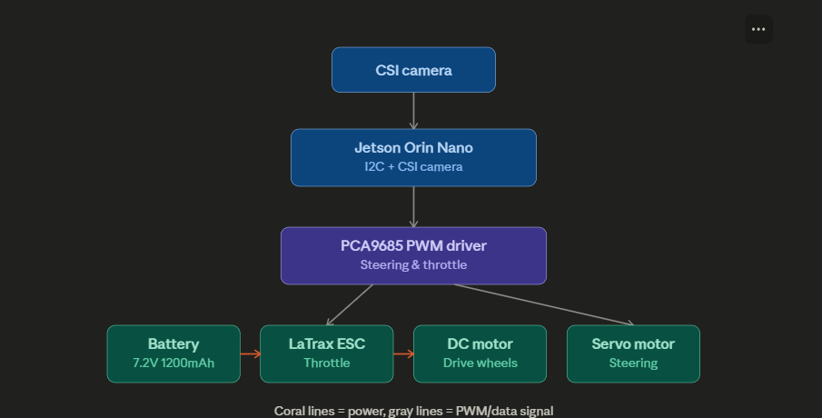

# Nvidia Jetson Orin Nano jetracer
I created an autonomous AI race car by attaching the NVIDIA Jetson Orin Nano, which happens to be one of the most powerful edge AI computers developed by NVIDIA, to the chassis of a 1/18 scale LaTrax Rally RC car by fabricating my own plastic mounting plate to attach all necessary electronic components, including the computer board, PCA9685 servo driver, and signal multiplexer, without compromising the integrity of the chassis. In terms of hardware development, the greatest problem encountered was with drivetrain development when a cold solder joint, as well as overapplication of heat-shrink tubing to the bullet connectors between the ESC and the motor, was preventing the transfer of electricity due to load, as determined through a careful process of testing with pin swapping on each PWM. The greatest lesson learned from developing a project on such complex systems level is that true engineering is not about programming your code from scratch but about understanding the architecture of an existing system and determining how to fix it on nonstandard hardware.


| **Engineer** | **School** | **Area of Interest** | **Grade** | 
|:--:|:--:|:--:|:--:|
| Gautham N.K | Bellarmine College Prepratory | Mechanical Engineering | Incoming Junior

# Milestone 3: Autonomous Navigation & Neural Network Integration
<iframe width="1059" height="595" src="https://www.youtube.com/embed/OESsFsIwddU" title="Gautham N. K. Milestone 3" frameborder="0" allow="accelerometer; autoplay; clipboard-write; encrypted-media; gyroscope; picture-in-picture; web-share" referrerpolicy="strict-origin-when-cross-origin" allowfullscreen></iframe>

## Project Overview

For Milestone 3, the project transitions into full autonomous navigation using an onboard camera, an Nvidia Jetson compute platform, and a Convolutional Neural Network (CNN). The vehicle operates in two distinct modes:

1. **Autonomous Mode:** The front-facing camera acts as the visual sensor, continuously streaming track frames into the Nvidia Jetson ("the brain"). The Jetson runs a trained CNN regression model to process image data in real time, determining spatial trajectories and outputting steering targets.
2. **Manual Driver Mode:** A 2.4 GHz radio transmitter communicates with an onboard receiver. A hardware multiplexer routes throttle and steering commands dynamically — directing steering signals to the servo motor and throttle signals to the Electronic Speed Controller (ESC).

---

## Convolutional Neural Network (CNN) Deep Dive

### 1. Why Regression Instead of Classification

Most introductory CNN projects are classifiers — "is this a stop sign or a light?" — where the output is a discrete label pulled from a fixed set of categories via a softmax layer. Our navigation problem doesn't fit that mold: there's no finite set of "correct" track positions, only a continuous 2D space of possible target points on the image plane. So instead of a softmax over categories, the final layer is a **linear regression head** that outputs continuous (x, y) coordinates — normalized to a -1 to 1 range so the model's output is independent of the camera's native resolution. This is the same architectural family used in NVIDIA's JetRacer/JetBot road-following examples, and it's what lets a single forward pass through the network double as a steering command generator rather than a label picker.

### 2. Input Representation

Each camera frame is ingested as a 3D tensor: **Width × Height × Color Channels** (typically resized to 224×224×3 to match the input dimensions expected by pretrained ImageNet backbones like ResNet18). Before entering the network, each frame is normalized per-channel (mean/std matching the pretrained backbone's original training distribution) so that pixel intensity fluctuations from track lighting don't dominate over actual track geometry.

### 3. Feature Extraction — Convolutional Layers

The convolutional layers are the model's "eyes." Each layer slides a small matrix filter (kernel) — commonly 3×3 or 7×7 — across the image, computing a dot product at every spatial position. Early layers in the network tend to pick up low-level primitives: edges, color boundary lines, and contrast gradients (exactly the kind of thing that distinguishes track surface from track margin). As frames pass through deeper layers, the kernels start responding to more abstract, composite patterns — curvature of the track boundary, the vanishing point of a straightaway, or the visual "wedge" shape formed by two converging lane edges. Each convolutional layer also increases the number of channels (feature maps) while the spatial resolution shrinks, trading raw pixel detail for a richer description of *what* is in a given region.

### 4. Non-Linearity — ReLU

Without a non-linear activation function, stacking convolutional layers would collapse mathematically into a single linear operation, no matter how many layers you add — the network would only be capable of learning simple linear relationships between input pixels and output coordinates. The Rectified Linear Unit, `f(x) = max(0, x)`, is inserted after each convolution specifically to break that linearity. It's computationally cheap (just a threshold at zero) and it's what allows the network to model the actual non-linear geometry of a curving track — a relationship that a purely linear model could never approximate no matter how much training data it saw.

### 5. Pooling — Downsampling for Spatial Invariance

Pooling layers (typically max-pooling) reduce the spatial dimensions of each feature map, usually by taking the maximum value within a small window (e.g., 2×2) and discarding the rest. This does two things for us:

- **Reduces computational load**, which matters directly for real-time inference speed on the Jetson — fewer pixels to process per layer means a faster forward pass and lower steering latency.
- **Builds tolerance to small positional shifts.** Because the chassis vibrates and bounces slightly as it drives, the exact pixel location of a track edge shifts frame to frame even when the vehicle's actual position hasn't meaningfully changed. Pooling makes the network's output stable against these small physical jitters instead of over-reacting to them.

### 6. Dense / Output Layer

After the convolutional and pooling stages, the resulting feature maps are flattened into a single vector and passed through one or more fully connected (dense) layers, terminating in a final linear layer with exactly 2 outputs (or `2 × number of target categories`, if predicting multiple points). Those two numbers are interpreted directly as the (x, y) coordinates of the target point, rendered visually during testing as a target dot overlaid on the live camera feed. The steering controller then computes the horizontal delta between image center and that target x-coordinate, scales it by a steering gain, and issues the corresponding servo command — closing the loop between "what the camera sees" and "how the wheels turn."

### 7. Training Pipeline

- **Loss function:** Mean Squared Error (MSE) between the predicted (x, y) and the human-labeled ground truth point for each training frame. MSE is a natural fit for regression because it penalizes large deviations more heavily than small ones, pushing the model toward tighter tracking rather than "roughly close" predictions.
- **Optimizer:** Adam, chosen for its adaptive per-parameter learning rate, which tends to converge faster than plain SGD on small, custom datasets like ours.
- **Transfer learning:** Rather than training a CNN from scratch, we start from a ResNet18 backbone pretrained on ImageNet and replace only its final fully connected layer with our 2-output regression head. This lets the network reuse millions of images' worth of general-purpose edge/shape/texture knowledge, and only needs to learn the track-specific mapping — a major reason a dataset of only ~150 images was enough to get a usable initial model.
- **Data augmentation:** Random horizontal flips (with the corresponding x-label negated) and color jitter (brightness/contrast/saturation) were applied during training to artificially expand the effective dataset size and make the model more robust to lighting changes across different runs on the same track.
- **Iterative expansion:** Initial training runs (~150 images) produced steering predictions that settled into a rough but noisy target vector, with visible tracking drift in areas the dataset under-represented (sharp corners, shadowed sections). Additional targeted data collection in those specific failure regions — rather than blindly adding more random frames — was the more effective lever for reducing drift, since it directly patched the gaps the model was weakest on.

### 8. Real-Time Inference Constraints

Unlike a lot of CNN applications where inference can run offline, our model has to produce a new steering target on every incoming frame while the vehicle is moving — meaning the whole pipeline (frame capture → preprocessing → forward pass → steering computation → servo command) has to complete well within the camera's frame interval. This is part of why the Jetson platform (with onboard GPU acceleration) and a comparatively lightweight backbone like ResNet18 were chosen over deeper, more accurate but slower architectures — on this project, inference latency directly translates into how sharply the car can react to sudden track curvature.

---

## Hardware Modifications & Iterations

- **Battery & Power Management:** Remounted peripheral hardware to make room for a dedicated 3S LiPo battery, ensuring consistent voltage supply to the Nvidia Jetson during heavy computational loads.
- **Traction & Mechanical Tuning:** Upgraded to high-contact foam tires. Preventing mechanical wheel slip eliminates noisy displacement data, ensuring consistent correlation between visual frame inputs and vehicle position.

---

## New Addition: Hybrid Quantum-Classical Modulation Layer

### 1. Motivation

The CNN described above solves steering — it was trained exclusively on human-labeled `(x, y)` target points, so it has no learned signal for throttle whatsoever. In the current build, throttle is either a fixed constant or set manually through the radio transmitter, which means the vehicle's speed carries zero information about the actual difficulty of the section of track it's in: it drives a sharp hairpin and a long straightaway at the same commanded speed unless a human intervenes. This addition targets that specific gap. Rather than retraining the CNN to output a third value (which would require an entirely new labeled dataset with speed ground truth), we introduce a second, independent model — a small variational quantum circuit (VQC) built with Qiskit — that reads a summary of recent driving conditions and outputs a throttle modulation signal. It runs live, on the Jetson, while the car is driving autonomously, but on a separate and much slower cadence than the CNN, for reasons explained in Section 8.

### 2. Why the Circuit Can't Sit Inside the CNN's Control Loop

It's worth being precise about what Qiskit is actually doing on this hardware, since it shapes every design decision below. Without access to real IBM quantum hardware, Qiskit's circuits execute as **classical simulations** — every "quantum" operation is matrix multiplication carried out on the Jetson's own CPU. There is no computational speedup from using a quantum circuit here; if anything, circuit simulation is slower than an equivalent classical operation, since the simulator prioritizes numerical correctness over throughput.

Benchmarked on the Jetson's ARM CPU, a small (4-6 qubit) circuit — including transpilation and parameter binding — costs roughly **50-300ms per forward pass**, growing quickly with added qubits or circuit depth. The CNN's steering loop, by contrast, has to complete a full capture-inference-servo cycle within **33-100ms** to stay reactive at driving speed (Section 8 of the CNN Deep Dive). A quantum circuit simply cannot be inserted into that per-frame path without introducing visible steering lag. This is why the VQC is architected as a second, slower loop rather than a replacement for any part of the CNN.

### 3. Input Representation — the Context Vector

Instead of a single camera frame, the VQC's input is a small hand-engineered feature vector summarizing the *last several seconds* of driving, refreshed roughly once per second:

- **Recent curvature** — derived from the variance of the CNN's predicted `x`-coordinate over the last N frames; a straightaway produces near-zero variance, a chicane produces high variance.
- **Prediction confidence proxy** — how close the CNN's predicted target point has been sitting to the edges of the frame versus the center, as a rough stand-in for how "in control" the current view is.
- **Recent steering correction magnitude** — the average absolute servo delta applied over the buffer window, capturing how hard the controller has had to work.
- **Trend** — the derivative (rate of change) of curvature across the buffer, distinguishing "entering a turn" from "exiting one."

These four values are rescaled to the `[0, π]` range expected by the encoding layer described next.

### 4. Encoding Layer — Loading Classical Data onto Qubits

Each of the four context features is mapped onto its own qubit using a `Ry` rotation gate: `Ry(f_i)` rotates qubit `i` by an angle proportional to feature `f_i`. All four qubits start in the reference state `|0⟩`; after this layer, each independently encodes one scalar from the context vector as a point on its Bloch sphere. This step, called **angle encoding**, is purely a data-loading operation — no interaction between qubits has happened yet.

### 5. Entangling Layer — Modeling Feature Interaction

A chain of `CNOT` (controlled-NOT) gates is applied next: q0 controls q1, q1 controls q2, q2 controls q3. Because each qubit is already in superposition from the encoding step, this entangles them — the four-qubit system becomes a single joint state that can no longer be decomposed into independent per-qubit descriptions. Practically, this is the mechanism that lets the circuit represent *combinations* of context features rather than treating them independently — e.g., "high curvature and high recent correction" can map to a different output than either factor alone would under a simple weighted sum.

### 6. Variational Layer — the Trainable Parameters

A second round of rotation gates, `Rz(θ_0)` through `Rz(θ_3)`, is applied — but here the angles are **not** derived from the input data. They are free parameters, initialized randomly and updated during offline training, functionally equivalent to weights in a classical dense layer. This is the "variational" in VQC: the trainable component is the parameter set `θ`, optimized to make the circuit's output match desired throttle behavior, not any deeper quantum property of the circuit.

### 7. Measurement Layer — Extracting a Classical Signal

The circuit's final step reads out an **expectation value** ⟨Z⟩ for each qubit — a real number between -1 and 1 — via Qiskit's `Estimator` primitive. On physical quantum hardware this would require running the circuit repeatedly and averaging measurement outcomes ("shots"); Aer's local simulator instead computes the expectation value directly from the full statevector, which is part of why local simulation, despite being slow relative to classical layers, is at least exact rather than approximate.

Two of the four resulting values are rescaled and used directly: one as a **steering bias correction** (a small additive adjustment layered on top of the CNN's PD steering output), and one as a **throttle multiplier** (scaling the base commanded speed up on straightaways and down through detected turns).

### 8. Training Pipeline

- **Where it happens:** entirely offline, in the notebook — never on the car while driving.
- **Loss function:** Mean Squared Error between the circuit's throttle-multiplier output and a target multiplier derived from recorded human driving sessions (higher speed on low-curvature stretches, reduced speed approaching high-curvature stretches).
- **Gradient computation:** quantum circuits aren't differentiable in the standard autograd sense, since measurement is probabilistic. Qiskit instead uses the **parameter-shift rule** — each `θ_i` is evaluated at `θ_i + π/2` and `θ_i - π/2`, and the gradient is proportional to the difference between the two. This is exact (not approximate) for `Ry`/`Rz` gates, but means each gradient step costs roughly 2× the number of parameters in circuit evaluations.
- **Optimizer:** the circuit is wrapped with Qiskit's `TorchConnector`, which lets PyTorch's Adam optimizer treat `θ_0...θ_3` as an ordinary trainable tensor, with parameter-shift gradients computed underneath.

### 9. Real-Time Deployment — the Two-Loop Architecture

The deployed system runs two loops at deliberately different rates:

| Loop | Rate | Job |
|---|---|---|
| Fast loop (unchanged) | 10-30 Hz | Camera → CNN → `(x,y)` → PD steering controller → servo |
| Slow loop (new) | 0.5-2 Hz | Context buffer → Qiskit VQC (Aer, Jetson CPU) → steering bias + throttle multiplier |

Only the trained VQC's **forward pass** runs live — no parameter-shift evaluations, no optimizer steps. That's what makes the 0.5-2 Hz rate achievable at all: it's a single matrix-algebra evaluation of a fixed, already-trained 4-qubit circuit, not a training step. The slow loop writes its two outputs to a shared variable that the fast loop reads every frame as an adjustable gain, so the CNN's steering path is never blocked waiting on the quantum circuit.

**What this addition does and does not claim:** the CNN remains the sole source of the steering decision, unchanged from Milestone 3. The VQC genuinely executes live on the Jetson while the car drives autonomously, but at a cadence matched to what a simulated quantum circuit can actually deliver on this hardware — not at frame rate, and not as a quantum performance advantage over an equivalent classical layer. Its contribution is architectural: it gives throttle, previously a fixed constant with zero adaptive signal, a live input for the first time.


### Track Layout

For the jetracer to work and CNN model to work successfully blue tape is as track outlines to create contrast for model to pickup


### Final Iteration 

Remounted the battery that powers all power electronics except the jetson orin and the servo driver to leave space for higher capacity battery to power jetson.


# Milestone 2: Hardware Validation & PWM Calibration
 <iframe width="985" height="554" src="https://www.youtube.com/embed/oSRA-IN0WpY" title="Gautham N. K. Milestone 2" frameborder="0" allow="accelerometer; autoplay; clipboard-write; encrypted-media; gyroscope; picture-in-picture; web-share" referrerpolicy="strict-origin-when-cross-origin" allowfullscreen></iframe>


 ## Calibration and Hardware Verification

This step is the essential link between the construction of the physical parts of the car and the software which controls it in the autonomous vehicle system architecture. With a combination of the Jetson Orin Nano along with the PCA9685 PWM Driver and Pololu Servo Multiplexer, the objective was to set up successful communication between the RC receiver, the electronics, steering servo and ESC. Calibration makes sure that the PWM signals from the software translate into the right hardware output before computer vision.

## Diagnosing the Throttle Anomaly 

As part of the early hardware testing phase, an important problem was identified: steering signals operated the servo properly but the motor did not respond to throttle signals even though it seemed like the ESC was receiving power. In order to identify the exact cause of the problem, a pin-swapping troubleshooting technique was used on the PCA9685 PWM channels – exchanging the pins of the steering and throttle signal connections proved that the PWM signals were working properly on all channels, ruling out any problems with the control board and remote control. The problem was then traced down to the actual mechanical drive. As a result of a thorough analysis of the wiring, two interrelated faults in the connection between the ESC and the motor were discovered: a bad cold solder joint where there was not enough tin flow resulting in a poor conductivity and heat shrink tubing wrapped too tightly around the connector that physically compressed the contacts and limited the current flow. While during bench testing the connection was fine, under the motor load the voltage drop across the connection was enough to prevent the ESC from functioning.

## PWM Calibration via Jupyter

Since the physical configuration of the robot has been successfully verified, the robot underwent calibration using the Jupyter Notebooks interacting with the Orin Nano in Wi-Fi mode. The precise values of pulse widths for the actuator channels have been determined. The steering calibration was performed by determining the optimal deflection angle and the center point offset in order to make sure that the minimum possible radius of curvature could be achieved for tight indoor tracks while avoiding any jamming of the wheels in full lock. Throttle calibration determined the following thresholds: the neutral deadband during which the ESC will stay idle without moving, the minimal pulse width needed for overcoming drivetrain friction, and the maximal acceleration without causing the wheels to slip on the indoor surface.

# Milestone 1: Assembly of the Hardware – Creating the JetRacer Platform
<iframe width="1285" height="723" src="https://www.youtube.com/embed/wCwTizB-BSY" title="Gautham N. K. Milestone 1" frameborder="0" allow="accelerometer; autoplay; clipboard-write; encrypted-media; gyroscope; picture-in-picture; web-share" referrerpolicy="strict-origin-when-cross-origin" allowfullscreen></iframe>

## Summary

In this milestone, I managed to assemble the whole physical platform of a completely autonomous JetRacer which is an RC car platform reconfigured to become an edge AI prototyping platform that utilizes an NVIDIA Jetson Nano board. The final product will be able to perceive the track via a camera and make decisions on how to control steering and acceleration based on a computer vision model running on this platform itself but will remain under my manual control at any point I desire.

## What I Created

To create a JetRacer platform, I took apart an ordinary RC car chassis in order to find out the main electronic elements:


The ESC (Electronic Speed Controller) – the part that gets an input signal and turns it into a command for the motor. In other words, it is a "throttle translator" between electronics and a motor.
The radio receiver – the electronic board that gets commands from an RC remote controlled by a human.

The Radio Receiver – the part of the system that receives data from a radio remote controlled by a person, enabling a person to control the car manually via the remote over radio waves, similar to an ordinary RC car.


## Next I performed the following steps:


Added the multiplexer (Mux) into the data line. The Mux acts as a switch that selects one out of multiple signals and routes it to the output. In this case, the Mux is between the RC receiver, the Jetson Nano and the ESC/servo, allowing to switch a switch that will control whether the AI or a human via the remote is in charge. This is the fundamental safety element of the entire project – when the autonomous system fails in any way, it can be overridden instantly by the manual system.
Connected the servo lines. The servo motor is responsible for controlling the steering angle. Connecting it to the Mux was required to enable both the AI and the manual remote control to control the steering angle accordingly.
This hardware setup forms the fundamental data control loop of the entire project:

Camera detects the line → Jetson Nano processes the line and makes steering/ throttle decisions → mux sends those decisions to the servo and ESC → car drives with the human being able to take control of anything by using the mux.

## The Technical Challenge: QSPI Firmware

The toughest aspect of this phase didn't lie in the wiring but in making sure the Jetson Nano could boot up properly in the first place.

The device had been idle for more than a year and I had thought that inserting an entirely new MicroSD card with the proper OS image would have been sufficient to get it started, just like with other devices. But it was not the case, the Jetson Nano couldn't start with a newly flashed MicroSD card.

The problem is simply that of one distinction which people do not usually make when dealing with ordinary computers; MicroSD card contains the operating system but not the firmware which instructs the board how to boot in the first place. The startup firmware in question is stored on another physical memory chip on the board, QSPI flash (Quad Serial Peripheral Interface – a small, quick-access memory chip which is soldered on the board). In other words, the difference may be illustrated by the case when a car will not start if its ignition system (QSPI firmware) is out of date even though there is new fuel in the tank (new SD card/OS).

In the case when my board stayed unoperated for quite some time, the QSPI firmware on it became out of date and thus not compatible with the OS image which I attempted to load. I needed to:

Figure out that the problem is indeed a QSPI firmware problem, not the SD card nor some problem with the wiring itself.
Find a new version of QSPI firmware that can be uploaded directly to the chip using NVIDIA's recovery mode.
Boot from the new QSPI firmware successfully before the operating system from the SD card can load at all.


The updated QSPI firmware resolved the booting problems, and now the system runs perfectly fine.

## Next Steps

Having got my hardware assembled and my Jetson Nano working, the next steps are to achieve:


Setting up hardware communication — establishing the software-level communication (like I2C, UART, or GPIO protocols) allowing the Jetson Nano, the multiplexer, the servo, and the ESC to communicate with one another.
Testing computer vision models — testing different computer vision models to find out which works best to interpret the camera stream and steer the car through the track, taking into account both precision and speed.


This milestone is the foundation for the future work — nothing further can be done without the properly working hardware and the safety-first control switch.

# Hardware flowcharts

## Wiring Diagram 


## Power Architecture Flow Chart


## Signal flow Flow Chart


# Different applicable notebooks for training

## Expandned CNN Pipeline      
    

## Wiring Flowchart


##  Basic Motion Notebook
Hardware initialization with steering and throttle calibration

```python
# ==============================================================================
# Basic Motion Control Script (basic_motion.py)
# Source: NVIDIA-AI-IOT/jetracer
# Description: Hardware initialization, steering calibration, throttle control, 
#              and game controller steering binding for Nvidia JetRacer.
# ==============================================================================

# ------------------------------------------------------------------------------
# 1. VEHICLE INITIALIZATION & HARDWARE BINDING
# ------------------------------------------------------------------------------
# Initialize the Nvidia JetRacer vehicle platform.
# Depending on your build configuration, import NvidiaRacecar or WaveshareRacecar.

from jetracer.nvidia_racecar import NvidiaRacecar
# from jetracer.waveshare_racecar import WaveshareRacecar

car = NvidiaRacecar()


# ------------------------------------------------------------------------------
# 2. STEERING & THROTTLE CONTROL EXAMPLES
# ------------------------------------------------------------------------------
# Steering and throttle values accept floating point values from -1.0 to 1.0.

# Set steering to full left (-1.0), center (0.0), or full right (1.0)
car.steering = 0.0

# Set throttle (negative for reverse, positive for forward, 0.0 for stop)
car.throttle = 0.0


# ------------------------------------------------------------------------------
# 3. HARDWARE CALIBRATION
# ------------------------------------------------------------------------------
# Fine-tune hardware offset parameters to account for servo horn alignment 
# and ESC response windows.

# Adjust steering offset if the car pulls left or right when set to 0.0
car.steering_offset = 0.0

# Set steering gain to adjust turn radius limits
car.steering_gain = 1.0

# Calibrate steering channel mapping (PCA9685 servo driver channel)
car.steering_channel = 0

# Set throttle gain to limit maximum speed/power delivery
car.throttle_gain = 0.8


# ------------------------------------------------------------------------------
# 4. GAME CONTROLLER INTERFACE BINDING (IPYWIDGETS)
# ------------------------------------------------------------------------------
# Connect a USB or Bluetooth gamepad to dynamically control steering and throttle
# via traitlet links in a Jupyter environment.

import ipywidgets
import traitlets
from IPython.display import display

# Create a gamepad widget instance (index 0 is the primary connected controller)
controller = ipywidgets.Controller(index=0)

display(controller)

# Link controller axes directly to steering and throttle
# Axis 0 is typically the left stick X-axis (steering)
# Axis 1 or 3 is typically the stick Y-axis or trigger (throttle)
steering_link = traitlets.dlink((controller.axes[0], 'value'), (car, 'steering'))
throttle_link = traitlets.dlink((controller.axes[1], 'value'), (car, 'throttle'))

# Optional: Invert throttle or apply scaling transformation if necessary
# throttle_link = traitlets.dlink((controller.axes[1], 'value'), (car, 'throttle'), transform=lambda x: -x)
```
---

## Computer Vision & Interactive Regression Notebook

Below is the script for interactive regression dataset collection, model setup (ResNet18 backbone), live inference loop, and training interface:


```python
# ==============================================================================
# Interactive Regression Notebook (interactive_regression.py)
# Source: NVIDIA-AI-IOT/jetracer
# ==============================================================================

# ------------------------------------------------------------------------------
# 1. CAMERA INITIALIZATION
# ------------------------------------------------------------------------------
from jetcam.csi_camera import CSICamera
# from jetcam.usb_camera import USBCamera

camera = CSICamera(width=224, height=224)
camera.running = True


# ------------------------------------------------------------------------------
# 2. TASK & DATASET CONFIGURATION
# ------------------------------------------------------------------------------
import torchvision.transforms as transforms
from xy_dataset import XYDataset

TASK = 'road_following'
CATEGORIES = ['apex']
DATASETS = ['A', 'B']

TRANSFORMS = transforms.Compose([
    transforms.ColorJitter(0.2, 0.2, 0.2, 0.2),
    transforms.Resize((224, 224)),
    transforms.ToTensor(),
    transforms.Normalize([0.485, 0.456, 0.406], [0.229, 0.224, 0.225])
])

datasets = {}
for name in DATASETS:
    datasets[name] = XYDataset(TASK + '_' + name, CATEGORIES, TRANSFORMS, random_hflip=True)


# ------------------------------------------------------------------------------
# 3. DATA COLLECTION WIDGET
# ------------------------------------------------------------------------------
import cv2
import ipywidgets
import traitlets
from IPython.display import display
from jetcam.utils import bgr8_to_jpeg
from jupyter_clickable_image_widget import ClickableImageWidget

dataset = datasets[DATASETS[0]]
camera.unobserve_all()

camera_widget = ClickableImageWidget(width=camera.width, height=camera.height)
snapshot_widget = ipywidgets.Image(width=camera.width, height=camera.height)
traitlets.dlink((camera, 'value'), (camera_widget, 'value'), transform=bgr8_to_jpeg)

dataset_widget = ipywidgets.Dropdown(options=DATASETS, description='dataset')
category_widget = ipywidgets.Dropdown(options=dataset.categories, description='category')
count_widget = ipywidgets.IntText(description='count')

count_widget.value = dataset.get_count(category_widget.value)

def set_dataset(change):
    global dataset
    dataset = datasets[change['new']]
    count_widget.value = dataset.get_count(category_widget.value)

dataset_widget.observe(set_dataset, names='value')

def update_counts(change):
    count_widget.value = dataset.get_count(change['new'])

category_widget.observe(update_counts, names='value')

def save_snapshot(_, content, msg):
    if content['event'] == 'click':
        data = content['eventData']
        x = data['offsetX']
        y = data['offsetY']
        dataset.save_entry(category_widget.value, camera.value, x, y)
        snapshot = camera.value.copy()
        snapshot = cv2.circle(snapshot, (x, y), 8, (0, 255, 0), 3)
        snapshot_widget.value = bgr8_to_jpeg(snapshot)
        count_widget.value = dataset.get_count(category_widget.value)

camera_widget.on_msg(save_snapshot)

data_collection_widget = ipywidgets.VBox([
    ipywidgets.HBox([camera_widget, snapshot_widget]),
    dataset_widget,
    category_widget,
    count_widget
])

display(data_collection_widget)


# ------------------------------------------------------------------------------
# 4. MODEL DEFINITION & LOAD/SAVE CONTROLS
# ------------------------------------------------------------------------------
import torch
import torchvision

device = torch.device('cuda')
output_dim = 2 * len(dataset.categories)

model = torchvision.models.resnet18(pretrained=True)
model.fc = torch.nn.Linear(512, output_dim)
model = model.to(device)

model_save_button = ipywidgets.Button(description='save model')
model_load_button = ipywidgets.Button(description='load model')
model_path_widget = ipywidgets.Text(description='model path', value='road_following_model.pth')

def load_model(c):
    model.load_state_dict(torch.load(model_path_widget.value))

model_load_button.on_click(load_model)

def save_model(c):
    torch.save(model.state_dict(), model_path_widget.value)

model_save_button.on_click(save_model)

model_widget = ipywidgets.VBox([
    model_path_widget,
    ipywidgets.HBox([model_load_button, model_save_button])
])

display(model_widget)


# ------------------------------------------------------------------------------
# 5. LIVE EXECUTION THREAD
# ------------------------------------------------------------------------------
import threading
import time
from utils import preprocess
import torch.nn.functional as F

state_widget = ipywidgets.ToggleButtons(options=['stop', 'live'], description='state', value='stop')
prediction_widget = ipywidgets.Image(format='jpeg', width=camera.width, height=camera.height)

def live(state_widget, model, camera, prediction_widget):
    global dataset
    while state_widget.value == 'live':
        image = camera.value
        preprocessed = preprocess(image)
        output = model(preprocessed).detach().cpu().numpy().flatten()
        category_index = dataset.categories.index(category_widget.value)
        x = output[2 * category_index]
        y = output[2 * category_index + 1]
        
        x = int(camera.width * (x / 2.0 + 0.5))
        y = int(camera.height * (y / 2.0 + 0.5))
        
        prediction = image.copy()
        prediction = cv2.circle(prediction, (x, y), 8, (255, 0, 0), 3)
        prediction_widget.value = bgr8_to_jpeg(prediction)

def start_live(change):
    if change['new'] == 'live':
        execute_thread = threading.Thread(target=live, args=(state_widget, model, camera, prediction_widget))
        execute_thread.start()

state_widget.observe(start_live, names='value')

live_execution_widget = ipywidgets.VBox([
    prediction_widget,
    state_widget
])

display(live_execution_widget)


# ------------------------------------------------------------------------------
# 6. TRAINING & EVALUATION PIPELINE
# ------------------------------------------------------------------------------
BATCH_SIZE = 8
optimizer = torch.optim.Adam(model.parameters())

epochs_widget = ipywidgets.IntText(description='epochs', value=1)
eval_button = ipywidgets.Button(description='evaluate')
train_button = ipywidgets.Button(description='train')
loss_widget = ipywidgets.FloatText(description='loss')
progress_widget = ipywidgets.FloatProgress(min=0.0, max=1.0, description='progress')

def train_eval(is_training):
    global BATCH_SIZE, LEARNING_RATE, MOMENTUM, model, dataset, optimizer, eval_button, train_button, accuracy_widget, loss_widget, progress_widget, state_widget
    try:
        train_loader = torch.utils.data.DataLoader(
            dataset,
            batch_size=BATCH_SIZE,
            shuffle=True
        )
        state_widget.value = 'stop'
        train_button.disabled = True
        eval_button.disabled = True
        time.sleep(1)
        
        if is_training:
            model = model.train()
        else:
            model = model.eval()
            
        while epochs_widget.value > 0:
            i = 0
            sum_loss = 0.0
            for images, category_idx, xy in iter(train_loader):
                images = images.to(device)
                xy = xy.to(device)
                
                if is_training:
                    optimizer.zero_grad()
                    
                outputs = model(images)
                
                loss = 0.0
                for batch_idx, cat_idx in enumerate(list(category_idx.flatten())):
                    loss += torch.mean((outputs[batch_idx][2 * cat_idx:2 * cat_idx+2] - xy[batch_idx])**2)
                loss /= len(category_idx)
                
                if is_training:
                    loss.backward()
                    optimizer.step()
                    
                count = len(category_idx.flatten())
                i += count
                sum_loss += float(loss)
                progress_widget.value = i / len(dataset)
                loss_widget.value = sum_loss / i
                
            if is_training:
                epochs_widget.value = epochs_widget.value - 1
            else:
                break
    except Exception as e:
        pass
        
    model = model.eval()
```
---

## Autonomous Road Following & Vision Pipeline Notebook (road_following.py)
Implements real-time target point regression using a ResNet-18 backbone. Converts predicted steering coordinates into PWM servo commands on Jetson Orin Nano hardware.

```Python
import cv2
import ipywidgets
import traitlets
from ipywidgets import Layout
import torch
from torch2trt import TRTModule
from jetracer.nvidia_racecar import NvidiaRacecar
from jetcam.csi_camera import CSICamera
from jetcam.utils import bgr8_to_jpeg
from utils import preprocess

# 1. Load the optimized TensorRT model
model_trt = TRTModule()
model_trt.load_state_dict(torch.load('model_08-06_trt.pth'))

# 2. Initialize racecar hardware and CSI camera
car = NvidiaRacecar()
camera = CSICamera(width=224, height=224, capture_fps=65)

# 3. Setup interactive UI widgets
state_widget = ipywidgets.ToggleButtons(options=['On', 'Off'], description='Camera', value='On')
prediction_widget = ipywidgets.Image(format='jpeg', width=camera.width, height=camera.height)
live_execution_widget = ipywidgets.VBox([
    state_widget,
    prediction_widget
])

network_output_slider = ipywidgets.FloatSlider(
    description='Network Output', min=-1.0, max=1.0, value=0, step=0.01, orientation='horizontal', disabled=False, layout={'width': '400px'}
)
steering_gain_slider = ipywidgets.FloatSlider(
    description='Steering Gain', min=-1.0, max=1.0, value=-0.7, step=0.01, orientation='horizontal', layout={'width': '300px'}
)
steering_bias_slider = ipywidgets.FloatSlider(
    description='Steering Bias', min=-0.5, max=0.5, value=0.0, step=0.01, orientation='horizontal', layout={'width': '300px'}
)
steering_value_slider = ipywidgets.FloatSlider(
    description='Steering', min=-1.0, max=1.0, value=0, step=0.01, orientation='horizontal', disabled=False, layout={'width': '400px'}
)
throttle_slider = ipywidgets.FloatSlider(
    description='Throttle', min=-1.0, max=1.0, value=0.15, step=0.01, orientation='vertical'
)

# 4. Link UI controls to car hardware attributes
steering_gain_link = traitlets.link((steering_gain_slider, 'value'), (car, 'steering_gain'))
steering_offset_link = traitlets.link((steering_bias_slider, 'value'), (car, 'steering_offset'))
throttle_slider_link = traitlets.link((throttle_slider, 'value'), (car, 'throttle'))

# Display the control dashboard in Jupyter
display(
    ipywidgets.HBox([
        ipywidgets.VBox([
            network_output_slider,
            ipywidgets.Label(value="X"),
            steering_gain_slider,
            ipywidgets.Label(value="+"),
            steering_bias_slider,
            ipywidgets.Label(value="||"),
            steering_value_slider
        ], layout=Layout(align_items='center')),
        live_execution_widget,
        throttle_slider
    ])
)

# 5. Define main image callback & inference update function
def update(change):
    global network_output_slider, steering_gain_slider, steering_bias_slider, steering_value_slider, car, camera, prediction_widget, state_widget
    
    new_image = change['new']
    image = preprocess(new_image).half()
    
    output = model_trt(image).detach().cpu().numpy().flatten()
    
    x = float(output[0])
    y = float(output[1]) if len(output) > 1 else float(output[0])
    
    network_output_slider.value = x
    
    steering = x * steering_gain_slider.value + steering_bias_slider.value
    
    if steering < -1.0:
        steering_value_slider.value = -1.0
    elif steering > 1.0:
        steering_value_slider.value = 1.0
    else:
        steering_value_slider.value = steering
        
    car.steering = steering_value_slider.value
    
    if state_widget.value == 'On':
        x_pixel = int(camera.width * (x / 2.0 + 0.5))
        y_pixel = int(camera.height * (y / 2.0 + 0.5))
        
        prediction = new_image.copy()
        prediction = cv2.circle(prediction, (x_pixel, y_pixel), 8, (255, 0, 0), 3)
        prediction_widget.value = bgr8_to_jpeg(prediction)

# Initialize camera feed update
update({'new': camera.value})

# Start camera observer loop
camera.observe(update, names='value')

# -------------------------------------------------------------
# Note: To stop execution safely and halt motors, run this:
# camera.unobserve(update, names='value')
# car.steering = 0
# car.throttle = 0
# -------------------------------------------------------------
```
---

# JetRacer Project Parts List & Current Pricing (July 2026)

This repository contains the comprehensive, itemized parts list for building a custom JetRacer autonomous RC car. 

> ⚠️ **Important Cost Note:** NVIDIA enacted a massive price hike across all Jetson modules and dev kits as of July 2026. The Jetson Orin Nano Super Dev Kit rose from $249 to ~$399, making the compute board the single largest line item in this build.

---

### Bill of Materials (BOM)

| Part | Role in the Build | Price (USD) | Source / Notes |
| :--- | :--- | :--- | :--- |
| **LaTrax Rally 1/18 4WD RTR** | Chassis, motor, ESC, steering servo, RC transmitter/receiver | $119.95 | RaceTraxRC / Traxxas dealers. Includes baseline electronics. |
| **NVIDIA Jetson Orin Nano Super Dev Kit** | Onboard compute — runs the Convolutional Neural Network (CNN) | ~$399.00 | Authorized NVIDIA distributors. Reflects July 2026 price adjustment. |
| **Adafruit PCA9685 16-Channel PWM Driver** | Generates precise servo/ESC PWM signals over I2C from the Jetson | ~$17.95 | Adafruit or major component retailers ($14.65–$22.00 variance). |
| **Pololu 4-Channel RC Servo Multiplexer** | Assembled board to switch controls between the CNN and manual RC | $17.95 | Direct from Pololu. |
| **CSI Camera** | Vision input for the CNN (Raspberry Pi Camera Mod 2 or Arducam IMX219) | $18.00 - $28.00 | Ensure compatibility with Jetson Nano CSI ports. |
| **3S LiPo Battery** | Dedicated stable power supply for the Jetson board and electronics | ~$20.00 - $30.00 | Do not share this with the main drive motor to avoid power drops. |
| **LiPo Balance Charger** | Safety-rated charger for the 3S LiPo battery | ~$20.00 - $25.00 | Mandatory for LiPo battery safety. |
| **5V/3A UBEC / Buck Converter** | Steps down 3S LiPo voltage to a stable 5V for the Jetson | ~$8.00 - $12.00 | High-efficiency buck converter recommended. |
| **MicroSD Card (64GB–128GB)** | Jetson boot drive and OS storage (U3/A2 rated) | ~$10.00 - $15.00 | High read/write speed required for OS stability. |
| **MPU-6050 IMU Module** | Feeds telemetry data to active rear-wing hysteresis controller | ~$12.90 | DigiKey (Name-brand); generic GY-521 boards run ~$5–$8. |
| **Micro Servo** | Physical actuator to change the active rear wing angle | ~$8.00 - $15.00 | Standard metal-gear micro servo. |
| **Hardware & Consumables** | Jumper wires, perfboard/breakout, standoffs, zip ties | ~$15.00 - $20.00 | General assembly and structural mounting wire/hardware. |

### Project Budget Estimates
* **Estimated Minimum Total:** ~$650.00
* **Estimated Maximum Total:** ~$700.00
*(Totals depend on exact choices for camera, battery, and minor hardware components)*

---

### Critical Build Notes
1. **All-In-One Chassis:** The LaTrax Rally kit is an "Ready-To-Run" (RTR) package. It already includes its own Electronic Speed Controller (ESC), drive motor, steering servo, and 2.4GHz transmitter/receiver. You do not need to purchase these components separately.
2. **Component Reusability:** If you already own a high-speed MicroSD card, a LiPo balance charger, or standard micro servos from previous robotics/RC projects, you can easily shave up to $60.00 off the project total.

