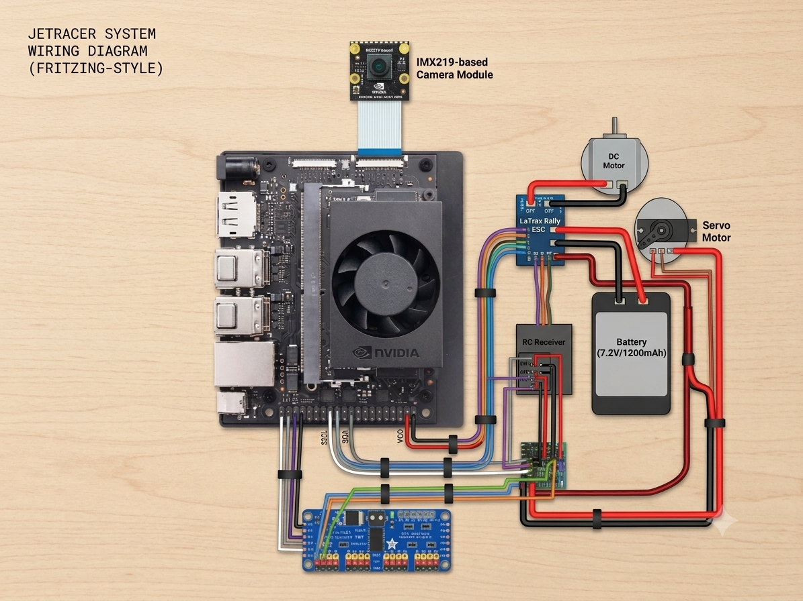
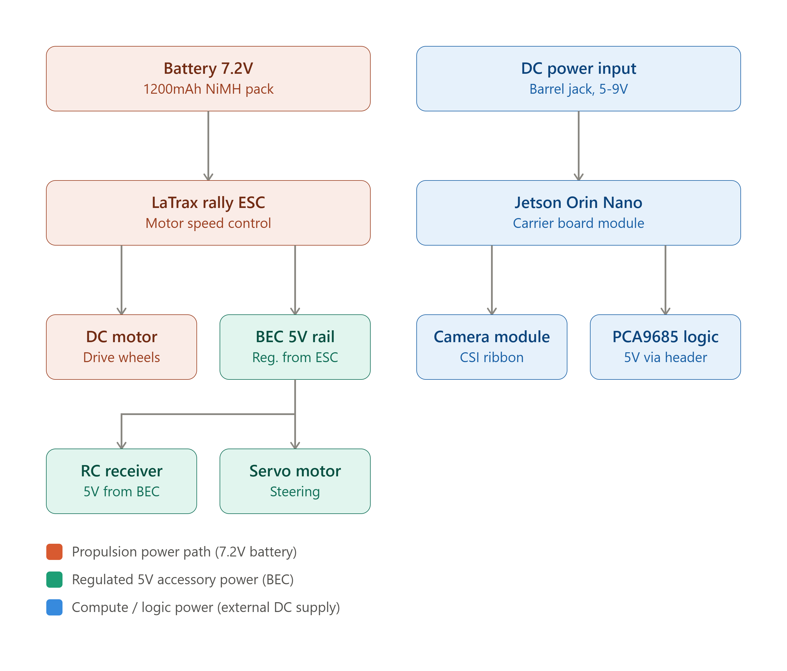

# Nvidia Jetson Orin Nano jetracer

#Milestone 2: Calibration of Hardware driver based testing

# Milestone 1: Assembly of the Hardware – Creating the JetRacer Platform
<iframe width="1285" height="723" src="https://www.youtube.com/embed/wCwTizB-BSY" title="Gautham N. K. Milestone 1" frameborder="0" allow="accelerometer; autoplay; clipboard-write; encrypted-media; gyroscope; picture-in-picture; web-share" referrerpolicy="strict-origin-when-cross-origin" allowfullscreen></iframe>

## Summary

In this milestone, I managed to assemble the whole physical platform of a completely autonomous JetRacer which is an RC car platform reconfigured to become an edge AI prototyping platform that utilizes an NVIDIA Jetson Nano board. The final product will be able to perceive the track via a camera and make decisions on how to control steering and acceleration based on a computer vision model running on this platform itself but will remain under my manual control at any point I desire.

## What I Created

To create a JetRacer platform, I took apart an ordinary RC car chassis in order to find out the main electronic elements:


The ESC (Electronic Speed Controller) – the part that gets an input signal and turns it into a command for the motor. In other words, it is a "throttle translator" between electronics and a motor.
The radio receiver – the electronic board that gets commands from an RC remote controlled by a human.

The Radio Receiver – the part of the system that receives data from a radio remote controlled by a person, enabling a person to control the car manually via the remote over radio waves, similar to an ordinary RC car.


## Next I performed the following steps:


Added the multiplexer (Mux) into the data line. The Mux acts as a switch that selects one out of multiple signals and routes it to the output. In this case, the Mux is between the RC receiver, the Jetson Nano and the ESC/servo, allowing to switch a switch that will control whether the AI or a human via the remote is in charge. This is the fundamental safety element of the entire project – when the autonomous system fails in any way, it can be overridden instantly by the manual system.
Connected the servo lines. The servo motor is responsible for controlling the steering angle. Connecting it to the Mux was required to enable both the AI and the manual remote control to control the steering angle accordingly.
This hardware setup forms the fundamental data control loop of the entire project:

Camera detects the line → Jetson Nano processes the line and makes steering/ throttle decisions → mux sends those decisions to the servo and ESC → car drives with the human being able to take control of anything by using the mux.

## The Technical Challenge: QSPI Firmware

The toughest aspect of this phase didn't lie in the wiring but in making sure the Jetson Nano could boot up properly in the first place.

The device had been idle for more than a year and I had thought that inserting an entirely new MicroSD card with the proper OS image would have been sufficient to get it started, just like with other devices. But it was not the case, the Jetson Nano couldn't start with a newly flashed MicroSD card.

The problem is simply that of one distinction which people do not usually make when dealing with ordinary computers; MicroSD card contains the operating system but not the firmware which instructs the board how to boot in the first place. The startup firmware in question is stored on another physical memory chip on the board, QSPI flash (Quad Serial Peripheral Interface – a small, quick-access memory chip which is soldered on the board). In other words, the difference may be illustrated by the case when a car will not start if its ignition system (QSPI firmware) is out of date even though there is new fuel in the tank (new SD card/OS).

In the case when my board stayed unoperated for quite some time, the QSPI firmware on it became out of date and thus not compatible with the OS image which I attempted to load. I needed to:

Figure out that the problem is indeed a QSPI firmware problem, not the SD card nor some problem with the wiring itself.
Find a new version of QSPI firmware that can be uploaded directly to the chip using NVIDIA's recovery mode.
Boot from the new QSPI firmware successfully before the operating system from the SD card can load at all.


The updated QSPI firmware resolved the booting problems, and now the system runs perfectly fine.

## Next Steps

Having got my hardware assembled and my Jetson Nano working, the next steps are to achieve:


Setting up hardware communication — establishing the software-level communication (like I2C, UART, or GPIO protocols) allowing the Jetson Nano, the multiplexer, the servo, and the ESC to communicate with one another.
Testing computer vision models — testing different computer vision models to find out which works best to interpret the camera stream and steer the car through the track, taking into account both precision and speed.


This milestone is the foundation for the future work — nothing further can be done without the properly working hardware and the safety-first control switch.

# Schematics 



# Power Architecture Flow Chart


# Code
Here's where you'll put your code. The syntax below places it into a block of code. Follow the guide [here]([url](https://www.markdownguide.org/extended-syntax/)) to learn how to customize it to your project needs. 

```c++
void setup() {
  // put your setup code here, to run once:
  Serial.begin(9600);
  Serial.println("Hello World!");
}

void loop() {
  // put your main code here, to run repeatedly:

}

https://www.youtube.com/watch?v=JIqICeoYuvM

# Bill of Materials
Here's where you'll list the parts in your project. To add more rows, just copy and paste the example rows below.
Don't forget to place the link of where to buy each component inside the quotation marks in the corresponding row after href =. Follow the guide [here]([url](https://www.markdownguide.org/extended-syntax/)) to learn how to customize this to your project needs. 

| **Part** | **Note** | **Price** | **Link** |
|:--:|:--:|:--:|:--:|
| Item Name | What the item is used for | $Price | <a href="https://www.amazon.com/Arduino-A000066-ARDUINO-UNO-R3/dp/B008GRTSV6/"> Link </a> |
| Item Name | What the item is used for | $Price | <a href="https://www.amazon.com/Arduino-A000066-ARDUINO-UNO-R3/dp/B008GRTSV6/"> Link </a> |
| Item Name | What the item is used for | $Price | <a href="https://www.amazon.com/Arduino-A000066-ARDUINO-UNO-R3/dp/B008GRTSV6/"> Link </a> |

# Other Resources/Examples
One of the best parts about Github is that you can view how other people set up their own work. Here are some past BSE portfolios that are awesome examples. You can view how they set up their portfolio, and you can view their index.md files to understand how they implemented different portfolio components.
- [Example 1](https://trashytuber.github.io/YimingJiaBlueStamp/)
- [Example 2](https://sviatil0.github.io/Sviatoslav_BSE/)
- [Example 3](https://arneshkumar.github.io/arneshbluestamp/)

To watch the BSE tutorial on how to create a portfolio, click here.
